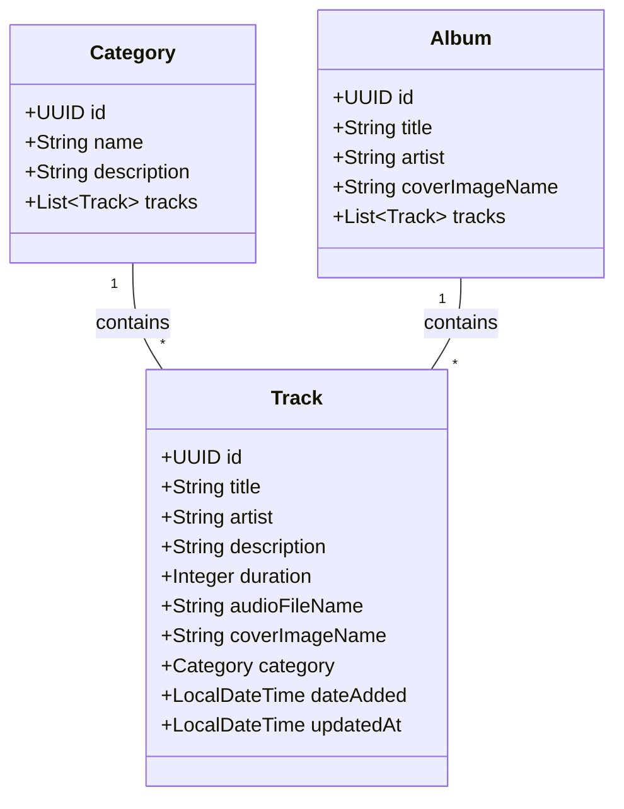

# InSideMusic-v2

A full-stack music streaming application featuring a Spring Boot backend and an Angular frontend, containerized with Docker.

## Project Structure

```
InSideMusic-v2/
├── backend/            # Spring Boot Backend
│   └── backend/
│       ├── src/        # Java Source Code
│       ├── Dockerfile  # Backend Docker config
│       └── pom.xml     # Maven dependencies
├── frontend/           # Angular Frontend
│   ├── src/            # TypeScript Source Code
│   ├── Dockerfile      # Frontend Docker config
│   └── nginx.conf      # Nginx configuration
├── docker-compose.yml  # Docker Compose orchestration
└── README.md           # Project Documentation
```

## Getting Started

### Prerequisites
- Docker & Docker Compose
- (Optional) Java 17 & Node.js 18+ for local development without Docker

### Running with Docker

1.  **Clone the repository** (if applicable).
2.  **Navigate to the project root**.
3.  **Run Docker Compose**:
    ```bash
    docker compose up --build -d
    ```

Access the application:
- **Frontend**: [http://localhost](http://localhost) (Port 80)
- **Backend API**: [http://localhost:8080](http://localhost:8080)
- **Database**: Port 5432

## Backend Architecture

### UML Class Diagram



### Technologies
- **Backend**: Spring Boot 3, Java 17, Spring Data JPA, PostgreSQL
- **Frontend**: Angular 18+, NgRx, Tailwind CSS
- **Infrastructure**: Docker, Nginx
